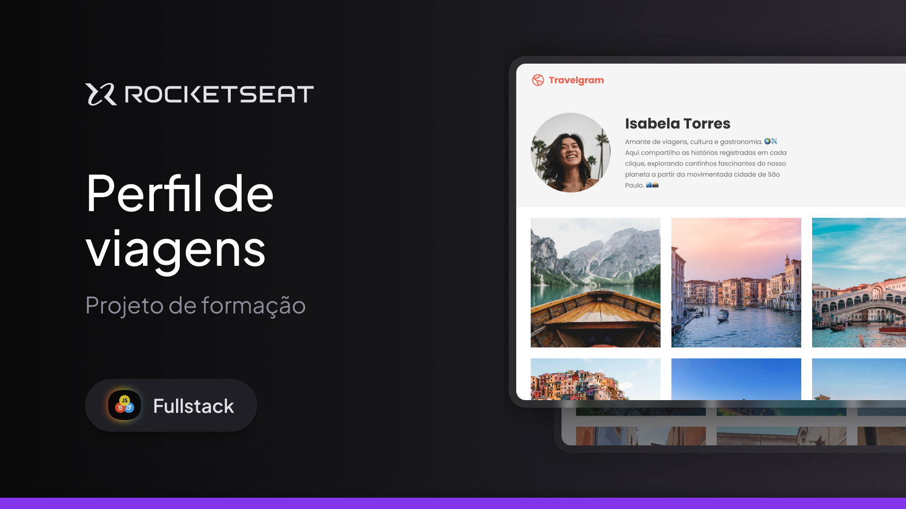

<h1 align="center"> Projeto Travelgram </h1>

Esse projeto foi desenvolvido durante um curso da Rocketseat para melhor entendimento meu e de outros alunos da Rocketseat  
<a href="https://app.rocketseat.com.br/classroom/avancando-no-html-e-css-2/group/projeto-travelgram/lesson/apresentando-o-projeto-4">Estude esse projeto em formato de vídeo clicando aqui.</a>

  <a href="#-tecnologias">Tecnologias</a>&nbsp;&nbsp;&nbsp;|&nbsp;&nbsp;&nbsp;
  <a href="#-projeto">Projeto</a>&nbsp;&nbsp;&nbsp;|&nbsp;&nbsp;&nbsp;
  <a href="#-layout">Layout</a>&nbsp;&nbsp;&nbsp;|&nbsp;&nbsp;&nbsp;
  <a href="#memo-licença">Licença</a>

  

  

 

## 🚀 Tecnologias

Esse projeto foi desenvolvido com as seguintes tecnologias:

- HTML e CSS
- Git e Github
- Figma

## 💻 Projeto

O Projeto Travelgram é feito para simular um perfil em um site de viagens.

- [Acesse o projeto finalizado, online](https://sr-cheikh.github.io/Projeto-Telegram/)

## 🔖 Layout

Você pode visualizar o layout do projeto através [DESSE LINK](https://www.figma.com/design/1kAHtivpu9diTTulZYwQmf/Perfil-de-viagens-(Community)-(Copy)?node-id=0-1&t=EHELS3663s2kA1nb-0). É necessário ter conta no [Figma](https://figma.com) para acessá-lo.

## :memo: Licença

Esse projeto está sob a licença MIT.

---